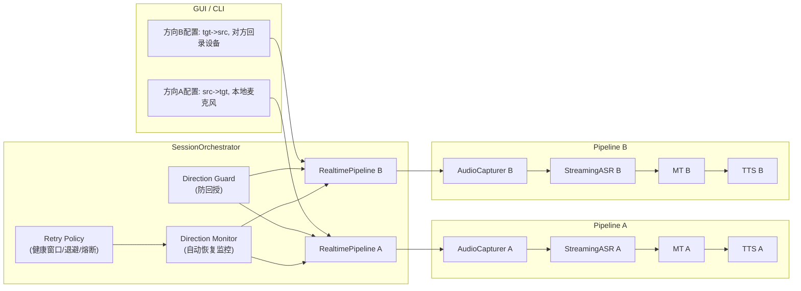
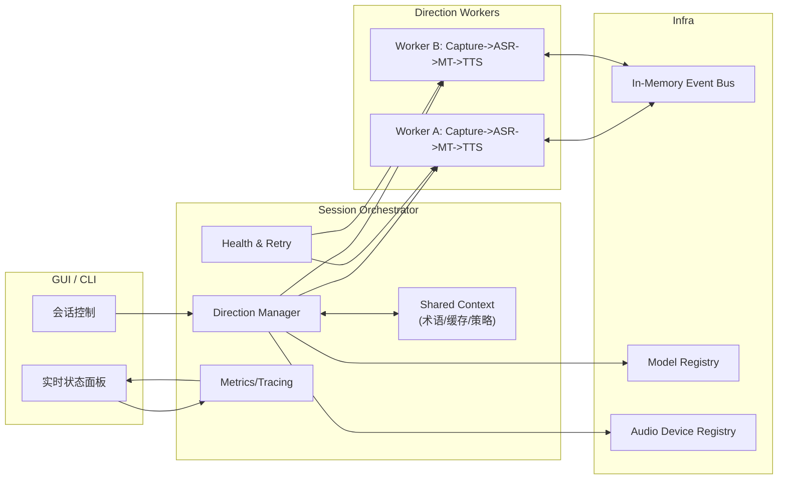

# LocalTrans 双向实时翻译架构设计图

## 1. 目标
- 支持稳定双向会话: `我 -> 对方` 与 `对方 -> 我`
- 保留现有方案可用性，不破坏已有 CLI/GUI 使用习惯
- 提升可观测性、可扩展性与后续多方会话演进能力

## 2. 当前实现架构（V1.2，已落地）

### 特点
- 优点: 双方向隔离、可观测性增强、包含防回授与自动恢复能力。
- 稳定性增强（V1.2）:
  - 自动恢复支持健康窗口（稳定运行达阈值后再清零重试计数）。
  - 失败恢复支持指数退避（避免高频重启抖动）。
  - 达到上限后进入熔断窗口（防止恢复风暴）。
- 限制: 两条链路仍存在重复初始化与资源占用；共享上下文能力仍在后续阶段完善。

## 3. 推荐目标架构（V2，建议下一阶段）

### 关键设计点
- `Session Orchestrator` 成为唯一会话控制面，负责方向生命周期、失败恢复、配置一致性。
- 两个方向仍保留 `Worker` 隔离，避免单点串扰。
- 引入共享上下文:
  - 术语、翻译缓存、ASR 文本后处理规则共享。
  - 方向间策略统一（如降级条件、队列背压阈值）。
- 引入统一观测面:
  - 每方向的输入设备、输出模式、模型与实时延迟可统一展示。
  - 便于 GUI 顶部状态与 CLI 会话摘要一致。

## 4. 组件职责
- `GUI/CLI`: 参数输入、会话启动/停止、状态展示。
- `Session Orchestrator`: 会话编排、健康检查、重试/降级策略、会话级配置下发。
- `Direction Worker`: 音频采集、ASR、MT、TTS 执行链路。
- `Shared Context`: 会话级术语与缓存、文本规整策略、方向间共享策略。
- `Metrics/Tracing`: 结构化日志与延迟指标，支撑稳定性分析。

## 5. 迁移策略（兼容现网）
- Phase 1（已完成）: 保持现有双 `RealtimePipeline`，抽取 `Orchestrator` 壳层（不改业务逻辑）。
  - 已实现 `SessionOrchestrator` 接管 CLI/GUI 双向会话。
  - 已实现跨方向防回授抑制（减少回声自激循环）。
  - 已实现方向级自动恢复（单方向异常自动重启）。
- Phase 2-1（已完成）: 恢复策略工程化。
  - 已实现健康窗口清零机制（避免短暂恢复后立即“误判健康”）。
  - 已实现指数退避冷却（`cooldown` 随连续失败增长并设上限）。
  - 已实现熔断窗口（达到重试上限后暂停恢复尝试）。
- Phase 2-2（进行中）: 抽象 `Worker` 接口与共享上下文模块，接入统一观测。
- Phase 3: 引入策略引擎（动态调参、自动降级），再评估多方会话扩展。

## 6. 风险与控制
- 风险: 编排层引入后复杂度上升。
- 控制: 保留 V1 快速回退开关；每阶段增量迁移，保证任意阶段可回滚。

## 7. 验收基线（建议）
- 功能正确性:
  - 双方向都能持续产生 `ASR->MT->TTS` 输出。
  - 单方向故障时，另一方向持续可用。
- 稳定性:
  - 连续运行 30 分钟以上，编排层无未恢复崩溃。
  - 自动恢复触发后会话级状态可观测（CLI 摘要 / GUI 顶部状态一致）。
  - 连续异常场景下不出现重启风暴（可观测到退避与熔断行为）。
- 可观测性:
  - 日志可区分方向（A/B）与异常类型。
  - 可定位防回授抑制触发原因（设备路由/阈值/时间窗）。
  - 可查看方向级恢复状态（重试次数、当前冷却、是否熔断）。

## 8. 与业内先进方案对齐情况
- 已对齐:
  - 会话编排层（方向生命周期统一管理）。
  - 方向故障隔离与方向级自动恢复。
  - 防回授保护（减少跨方向回声自激）。
- 未完全对齐:
  - 尚未实现统一 Worker 资源池与共享上下文（模型复用能力有限）。
  - 尚未形成策略引擎（动态阈值、自适应降级）。
  - 仍以级联 `ASR->MT->TTS` 为主，未引入端到端 Simul-S2ST 主路径。
