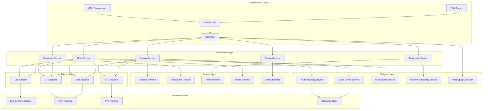
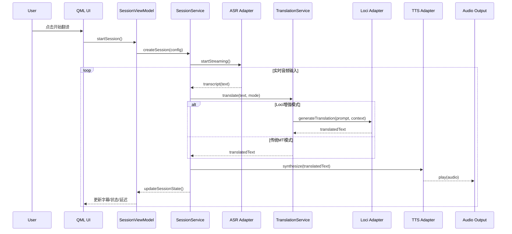
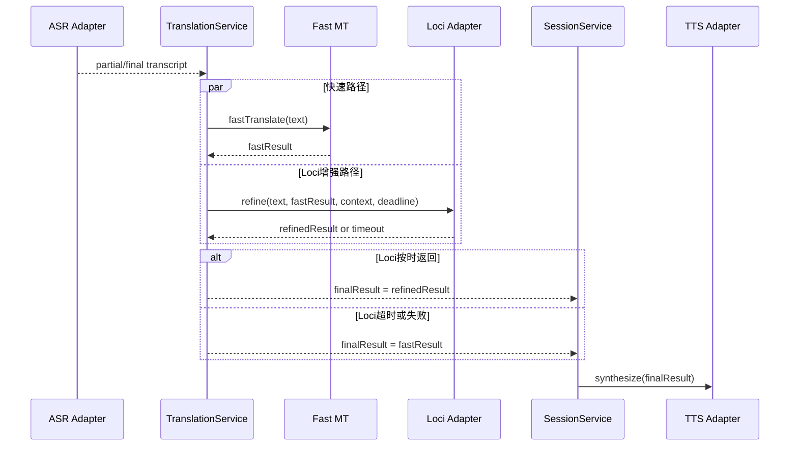
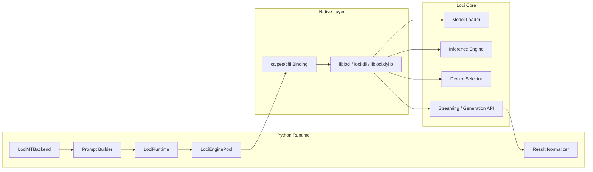
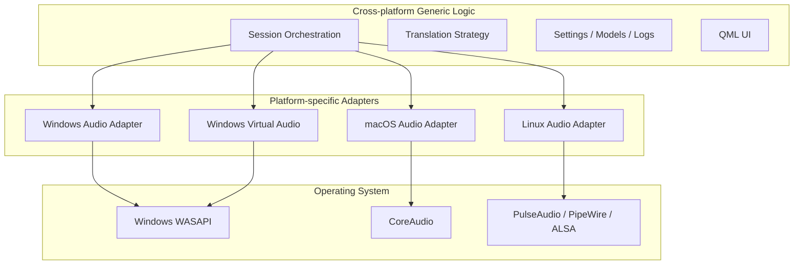

# LocalTrans 基于 Loci + QML 的软件架构图

## 1. 定位前提

本架构以前提定位为基础：

**LocalTrans 是一个面向会议与实时沟通场景的跨平台本地 AI 翻译工作台。**

因此该架构默认遵守以下约束：

- 核心主链路是实时语音翻译
- `ASR / TTS / 音频路由` 是产品底座
- `Loci` 负责增强翻译与语言理解能力
- 桌面跨平台优先于移动端扩展
- 引入 `Loci` 后仍必须满足低延迟实时翻译

## 2. 架构目标

目标架构服务于以下需求：

- QML 跨平台桌面界面
- Loci 驱动的高质量 AI 翻译与语言理解能力
- 现有 ASR / TTS / 音频模块复用
- Windows / macOS / Linux 桌面跨平台运行

## 3. 总体架构图

## 4. 运行时实时翻译链路

## 4.1 低延迟混合翻译链路（推荐默认）

## 5. Loci 集成架构图

## 6. 平台能力分层图

## 7. 模块职责表

| 层级 | 模块 | 主要职责 |
|---|---|---|
| 表现层 | QML Pages / Components | 页面与交互展示 |
| 表现层 | ViewModels | 提供可绑定状态和命令 |
| 应用层 | SessionService | 会话生命周期和实时链路编排 |
| 应用层 | TranslationService | 翻译模式选择、时延预算控制、结果合并与回退 |
| 应用层 | ModelService | 模型状态、下载、路径管理 |
| 应用层 | DiagnosticsService | 环境检测、日志、健康检查 |
| AI 适配层 | Loci Adapter | Loci 模型加载、受约束推理调用与翻译增强 |
| AI 适配层 | ASR / MT / TTS Adapters | 封装现有后端 |
| 平台层 | Audio Device Service | 设备枚举与选择 |
| 平台层 | Audio Routing Service | 输出设备、虚拟设备路由 |
| Native 层 | Loci Dynamic Library | 原生推理能力 |

## 8. 面向产品定位的能力分层

### 8.1 基础实时能力

这些能力支撑“会议与实时沟通场景”的基本可用性：

- 设备枚举
- 音频输入输出
- ASR
- 翻译主链路
- TTS
- 会话编排
- 诊断与日志

### 8.2 Loci 增强能力

这些能力由 `Loci` 提供增强，不替代主链路底座：

- 高质量翻译
- 上下文增强翻译
- 术语控制翻译
- 风格控制
- 会话摘要
- 表达润色

实时模式要求：

- `Loci` 仅以受预算约束的增强方式接入
- 不允许阻塞快速翻译路径
- 超时时必须回退到快速路径结果

### 8.3 暂不纳入第一阶段主路径的能力

- 通用聊天助手
- 自由创作
- 多 Agent 编排
- 移动端统一架构

## 9. 推荐模块边界

### 7.1 QML 不应直接做的事

- 不直接调用 Loci
- 不直接调用 ASR / TTS
- 不直接读写本地配置文件
- 不直接依赖音频设备 API

### 7.2 ViewModel 不应直接做的事

- 不持有具体模型对象
- 不管理底层线程
- 不直接依赖第三方 AI 库

### 7.3 Loci Adapter 不应直接做的事

- 不处理 UI 状态
- 不处理页面跳转
- 不负责系统设备管理
- 不绕过 `TranslationService` 直接决定最终会话输出

### 7.4 TranslationService 必须负责的事

- 统一管理 `deadline/timeout`
- 决定 `fastResult/refinedResult` 的合并策略
- 在 `Loci` 超时时执行无阻塞回退
- 决定交给 `TTS` 的最终文本

## 10. 数据流说明

### 8.1 配置流

QML -> ViewModel -> SettingsService -> Config Domain -> 本地配置文件

### 8.2 翻译流

低延迟实时模式（默认）：

音频输入 -> ASR -> TranslationService -> Fast MT(立即产出) + Loci(并行增强, deadline) -> 合并决策 -> TTS -> 音频输出

高质量模式（可选）：

音频输入 -> ASR -> TranslationService -> `Loci` 主导翻译 -> TTS -> 音频输出

### 8.3 状态流

Native / Service -> ViewModel -> QML 绑定更新

## 11. 推荐实现策略

### 9.1 第一阶段

- 先实现 `Loci Adapter`
- 先保留现有 Python 后端结构
- 不立即迁移所有页面
- 先落地 `fast path + Loci refinement + deadline fallback`

### 9.2 第二阶段

- 新建 `PySide6 + QML` UI
- 建立 `ViewModel + Service` 模型

### 9.3 第三阶段

- 完成三平台桌面适配
- 完成统一打包

## 12. 架构结论

推荐将 `LocalTrans` 重构为：

- `QML` 负责表现层
- `Python` 负责应用服务与流程编排
- `Loci` 负责高质量 AI 翻译与语言理解增强能力
- 现有 `ASR / TTS` 继续作为专用能力模块存在
- 平台相关能力通过适配层隔离
- 实时默认策略采用 `fast path + Loci refinement + deadline fallback`

这样可以在保留现有工程资产的前提下，以最低风险演进到“面向会议与实时沟通场景的跨平台本地 AI 翻译工作台”。
